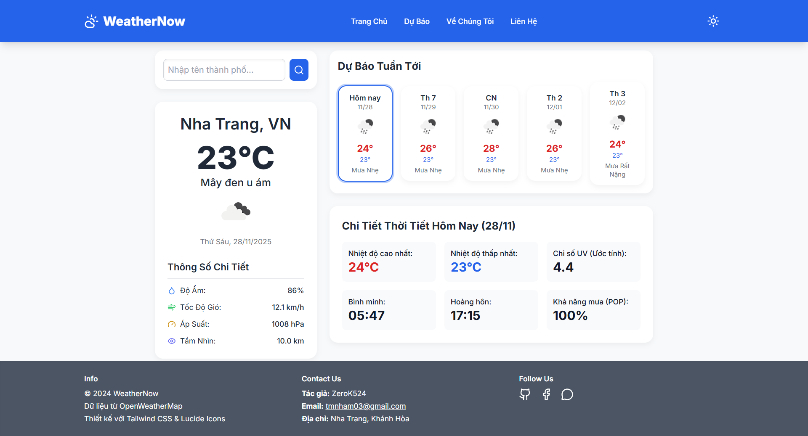
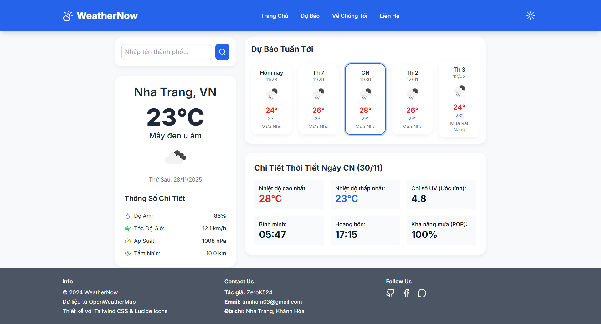
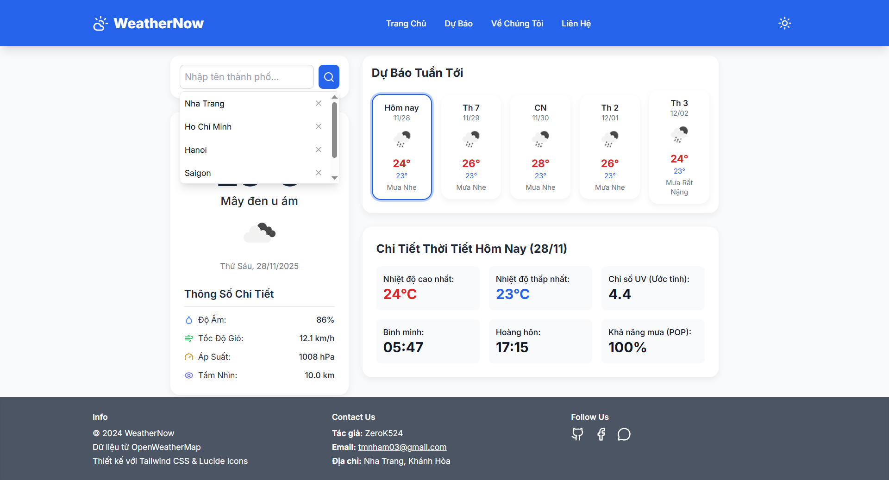
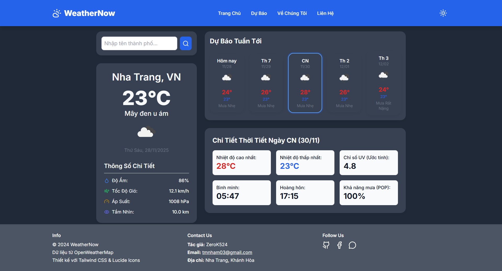
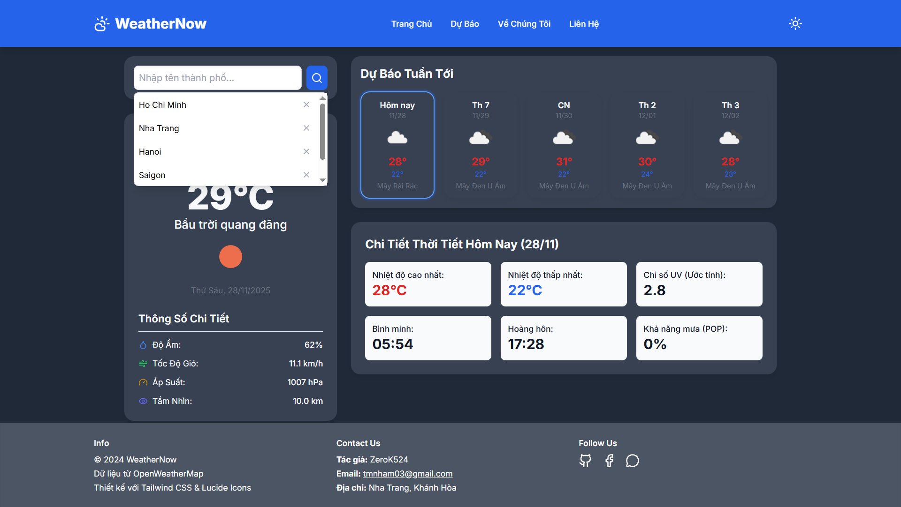

# WeatherNow - Ứng Dụng Thời Tiết

**WeatherNow** là một ứng dụng web hiển thị dự báo thời tiết hiện tại và dự báo tuần tới dựa trên dữ liệu từ **OpenWeatherMap API**. Ứng dụng được xây dựng hoàn toàn bằng **HTML, CSS, Tailwind CSS và JavaScript**, có giao diện hiện đại, responsive, và hỗ trợ chế độ **Dark Mode**.

---

## 🌤 Tính Năng

- **Tìm kiếm thời tiết theo thành phố:**  
  Người dùng nhập tên thành phố (ví dụ: Hà Nội, Nha Trang, Ho Chi Minh) và nhận thông tin thời tiết ngay lập tức.

- **Hiển thị thông tin chi tiết hiện tại:**
  - Nhiệt độ hiện tại
  - Điều kiện thời tiết (mưa, nắng, mây…)
  - Độ ẩm, tốc độ gió, áp suất, tầm nhìn
  - Biểu tượng thời tiết minh họa

- **Dự báo 5 ngày tới:**  
  Hiển thị nhiệt độ dự báo, biểu tượng thời tiết và tóm tắt ngắn gọn.

- **Chi tiết mở rộng của ngày được chọn:**
  - Nhiệt độ cao nhất/thấp nhất
  - Chỉ số UV
  - Thời gian bình minh & hoàng hôn
  - Khả năng mưa (POP)

- **Dark Mode & Toggle Theme:**  
  Hỗ trợ chuyển đổi nhanh giữa chế độ sáng và tối.

- **Lịch sử tìm kiếm:**  
  Lưu các thành phố đã tìm trước đó để truy cập nhanh.

- **Responsive & Mobile-Friendly:**  
  Thiết kế thích ứng trên mọi thiết bị, từ điện thoại đến desktop.

---

## ⚙️ Công Nghệ Sử Dụng

- **HTML5 & CSS3**: Cấu trúc giao diện và style cơ bản  
- **Tailwind CSS**: Thiết kế hiện đại, responsive, utility-first  
- **JavaScript (Vanilla JS)**: Logic xử lý API, DOM manipulation  
- **Lucide Icons**: Biểu tượng đẹp và trực quan  
- **OpenWeatherMap API**: Dữ liệu thời tiết chính xác và cập nhật  

---

## 🛠 Hướng Dẫn Cài Đặt

1. Clone dự án:

```bash
git clone https://github.com/ZeroK524/weather-app.git
```

2. Vào thư mục dự án:
```bash
cd weather-app
```
3. Mở file scripts/script.js, nhap API_KEY bằng OpenWeatherMap API Key của bạn(nếu có):
```bash
const API_KEY = "XXXXX";
```
4. Mở index.html trên trình duyệt
5. Images:




